# GUI Based Library Management System

## 📚 Project Description

The **Library Management System** is a GUI-based application developed using Python and MySQL. It simplifies library operations by allowing users to manage books, members, and transactions efficiently. The system includes features for adding, editing, deleting, searching, and managing book and member records, along with issuing and returning books.

This Library Management System (LMS) is a GUI-based application designed to streamline and automate library operations. The system provides an efficient way to manage books, members, and transactions like book issuance and returns. Built with Python and MySQL, this application uses the customtkinter library for an enhanced GUI experience, delivering a modern and user-friendly interface.

The system ensures data integrity and supports multiple roles (admin and member) for better management.

## ✨ Features

- **Book Management:** Add, edit, delete, and search books with detailed information like title, author, genre, and more.
- **Member Management:** Register, update, delete, and search member profiles.
- **Issue & Return:** Handle book issuance and returns with transaction records.
- **User Roles:** Support for admin roles to manage the system.
- **Interactive Dashboard:** View and manage all system activities from a central dashboard.

## Technical Stack
- **Programming Language:** Python
- **GUI Framework:** customtkinter
- **Database**: MySQL
- **IDE**: Any Python-compatible IDE (e.g., PyCharm, VS Code)


## 🖼️ Screenshots

| **Login Window** | **Admin Dashboard** |
|-------------------|----------------------|
| 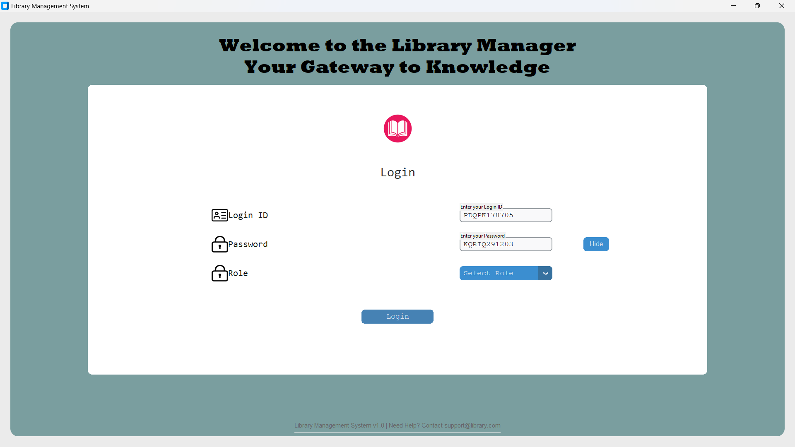 | 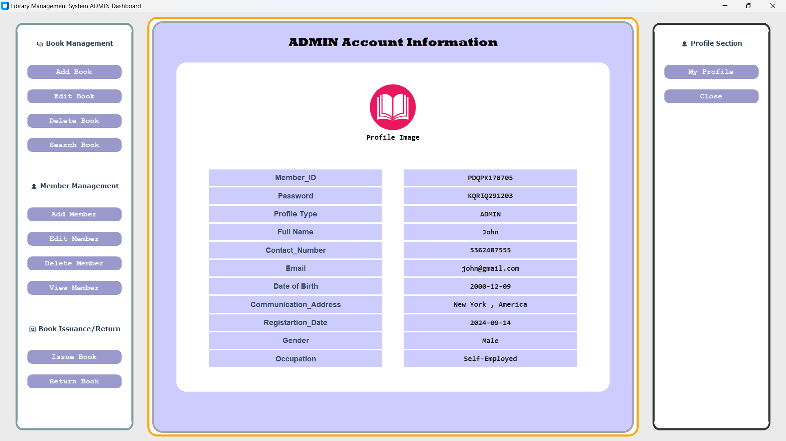 |

| **Add Book** | **Update Book** |
|--------------|------------------------|
| 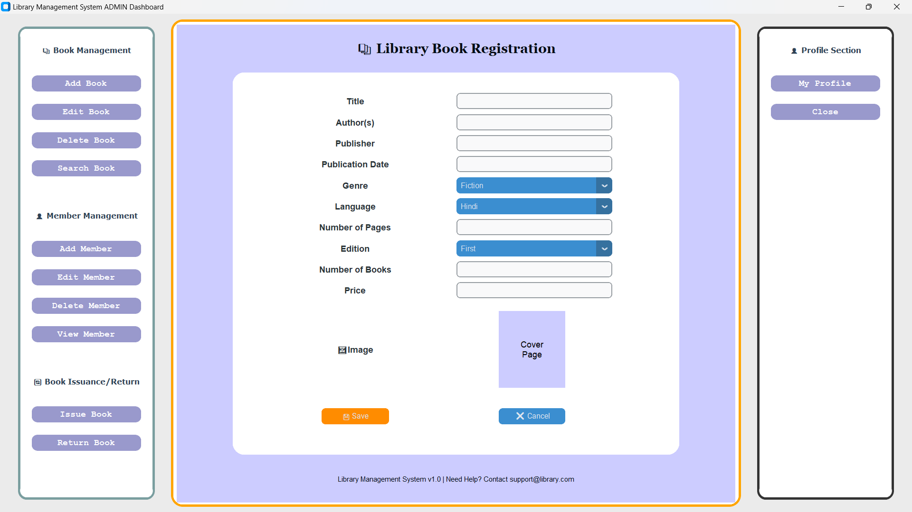 | 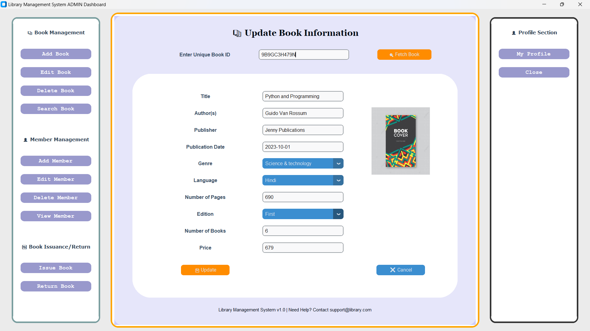 |

| **Delete Book** | **Search Book** |
|--------------|------------------------|
| 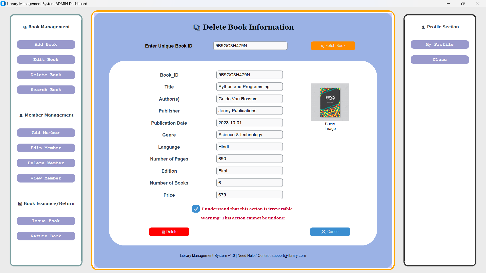 | 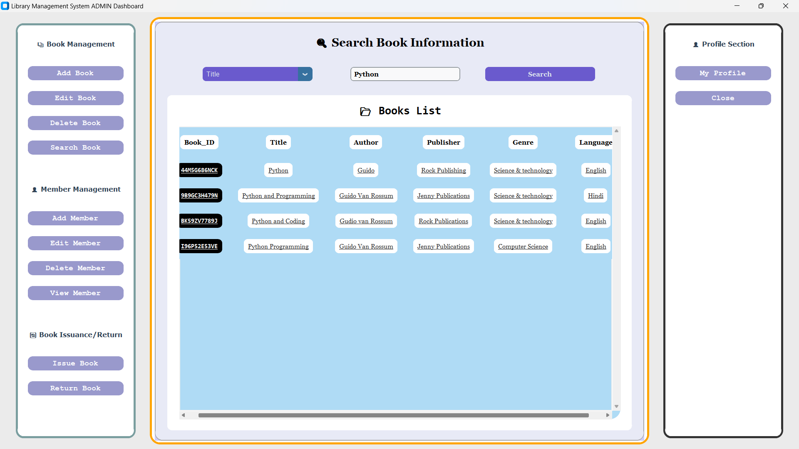 |

| **Add Member** | **Update Member** |
|--------------|------------------------|
|  | 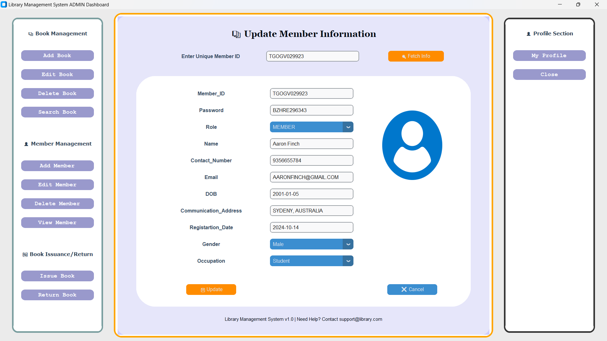 |

| **Delete Member** | **Search Member** |
|--------------|------------------------|
| 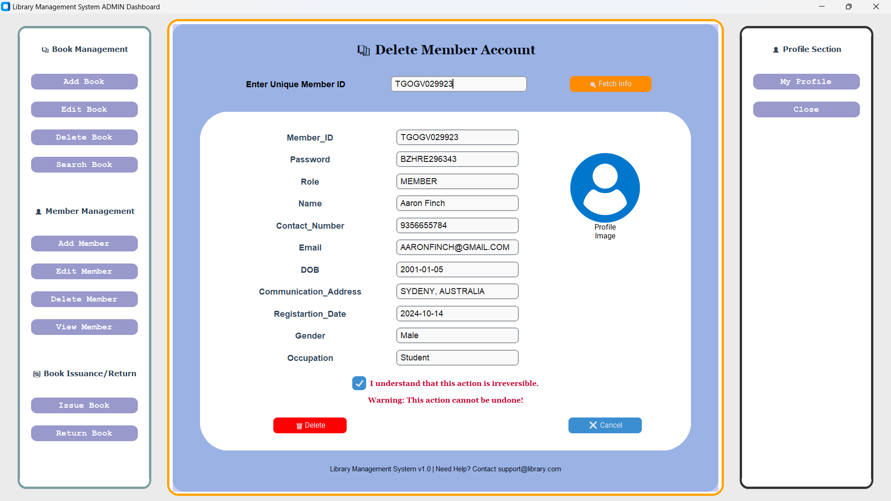 | 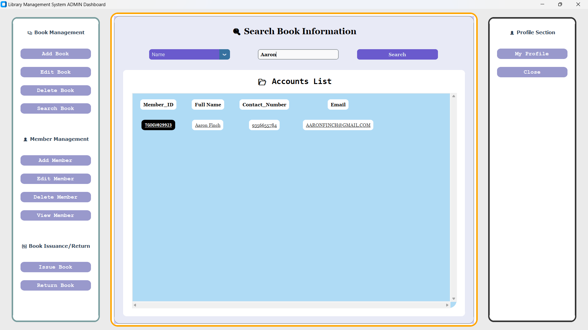 |

| **Issue Book** | **Return Book** |
|--------------|------------------------|
| 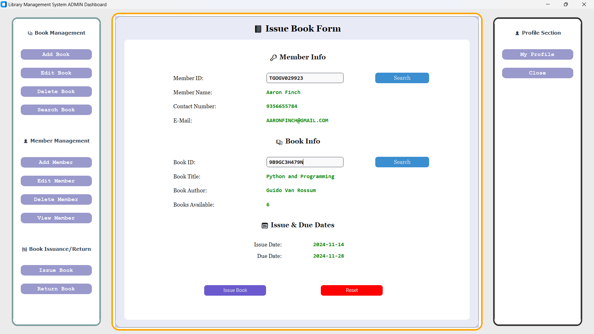 | 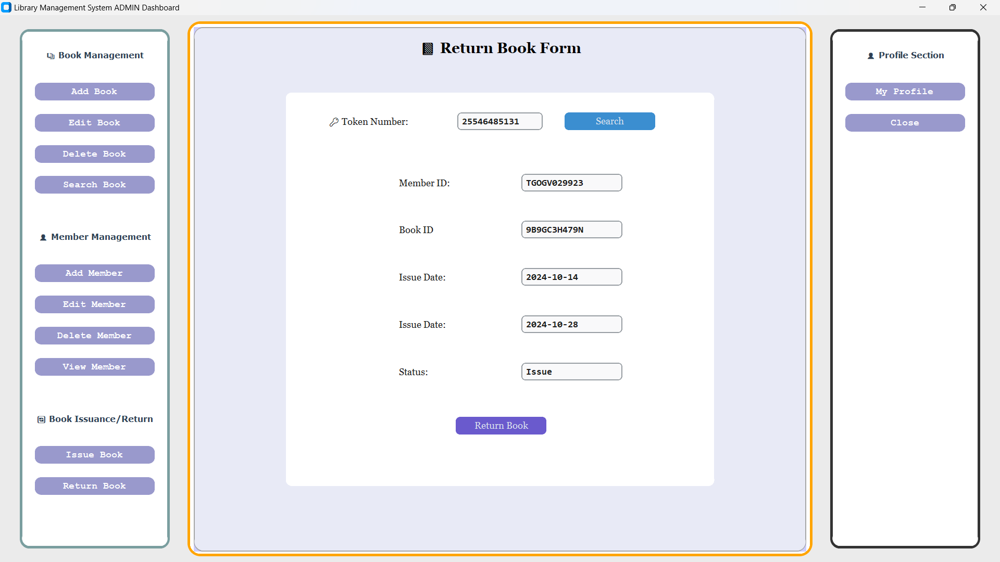 |


## 🛠️ Installation

1. Clone this repository:
   ```bash
   git clone https://github.com/mr-abhi-shek/GUI-Based-Library-Management-System.git
   
2. Navigate to the project directory:
   ```bash
   cd GUI-Based-Library-Management-System

3. Install required dependencies:
   ```bash
   pip install -r requirements.txt

4. Set up the MySQL database:
   Create a database named library_database.
   Import the provided SQL dump file to set up tables.

5. Run the application:
   ```bash
   python Login_Activity.py

## 🚀 Usage
- **Login:** Enter admin credentials to access the system.
- **Dashboard:** Navigate through the features to manage books, members, and transactions.
- **Logout:** Securely log out after use.
