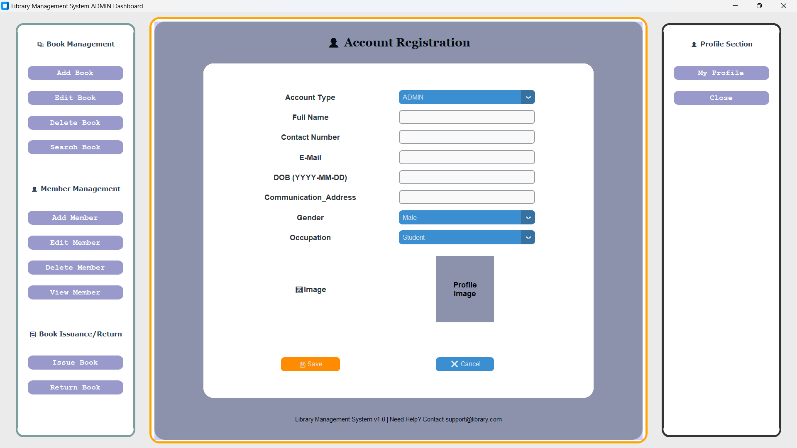

# GUI Based Library Management System

## 📚 Project Overview

The **Library Management System** is a GUI-based application developed using Python and MySQL. It simplifies library operations by allowing users to manage books, members, and transactions efficiently. The system includes features for adding, editing, deleting, searching, and managing book and member records, along with issuing and returning books.

## ✨ Features

- **Book Management:** Add, edit, delete, and search books with detailed information like title, author, genre, and more.
- **Member Management:** Register, update, delete, and search member profiles.
- **Issue & Return:** Handle book issuance and returns with transaction records.
- **User Roles:** Support for admin roles to manage the system.
- **Interactive Dashboard:** View and manage all system activities from a central dashboard.

## 🖼️ Screenshots

| **Login Window** | **Admin Dashboard** |
|-------------------|----------------------|
|  |  |

| **Add Book** | **Update Book** |
|--------------|------------------------|
|  |  |

| **Delete Book** | **Search Book** |
|--------------|------------------------|
|  |  |

| **Add Member** | **Update Member** |
|--------------|------------------------|
|  |  |

| **Delete Member** | **Search Member** |
|--------------|------------------------|
|  |  |

| **Issue Book** | **Return Book** |
|--------------|------------------------|
|  |  |


> **Note:** Replace `screenshots/<image_name>.png` with the actual image paths once added to your repository.

## 🛠️ Installation

1. Clone this repository:
   ```bash
   git clone https://github.com/<your-username>/Library-Management-System.git
